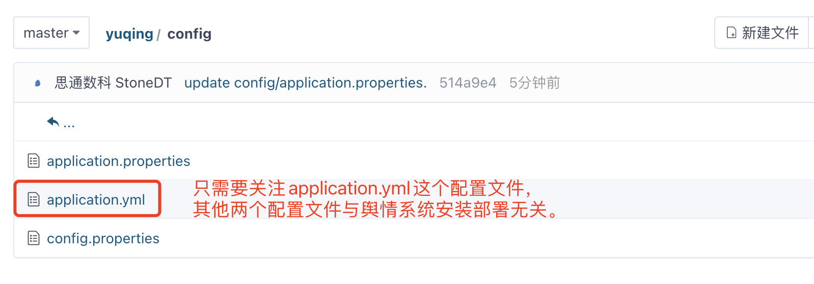
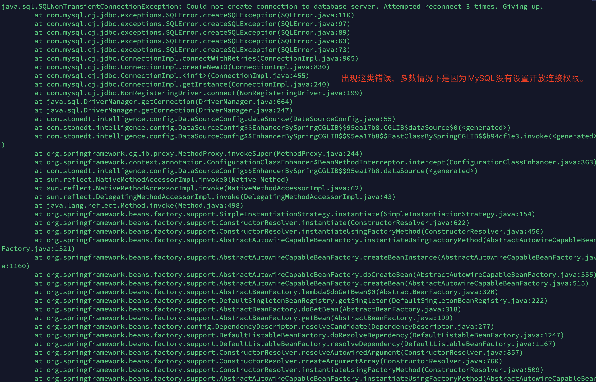

# 思通舆情安装配置手册

## 操作系统选择
我们推荐您使用 Linux Ubuntu 16 或 Ubuntu 18的版本。

Window 系统也可以使用，但我们并不推荐，

因为本手册最要针对 Linux 及 Ubuntu 安装配置过程说明指引。

## 安装java环境

我们推荐您使用 Java JDK8版本

JDK8 Oracle官方下载地址：[https://www.oracle.com/java/technologies/downloads/#java8
](https://www.oracle.com/java/technologies/downloads/#java8)

window安装JDK8 参见：
https://www.cnblogs.com/zhangzhixing/p/12953187.html

Linux安装JDK8 参见：
https://www.jianshu.com/p/75f0f34b599d

## 安装MySQL数据库

### 软件安装
Ubuntu apt-get 安装 参见：

https://blog.csdn.net/weixx3/article/details/80782479

Ubuntu 源码 安装 参见：

https://www.cnblogs.com/weijing24/p/4948880.html

### 配置远程权限
MySQL 5.5 和 MySQL 8.0配置MySQL连接权限的 **_方式不一样_** ，分别为：

MySQL 5.5+

> GRANT ALL PRIVILEGES ON . TO ‘root’@’%’ IDENTIFIED BY ‘123456’ WITH GRANT OPTION;
> 
> flush privileges;

MySQL 8.0+

> create user 'root'@'%' identified by '密码';
> 
> alter user 'root'@'%' identified by '新密码';
> 
> grant all privileges on *.* to 'root'@'%' with grant option;
> 
> flush privileges;

参见：

https://blog.csdn.net/weixin_43431593/article/details/106872836

https://www.cnblogs.com/gychomie/p/11013442.html

### 数据导入
我们使用了 [Flyway](https://flywaydb.org/) 数据库迁移工具。简单点说，就是在你部署应用的时候，帮你执行数据库脚本的工具。Flyway支持SQL和Java两种类型的脚本，你可以将脚本打包到应用程序中，在应用程序启动时，由Flyway来管理这些脚本的执行，帮你自动执行系统需要初始化的数据库的建表语句以及数据库脚本。

## 安装Redis

- 安装

  源码及apt安装

  http://www.imxmx.com/Item/1/211097.html

- 配置

  关于redis的配置这篇文章说的很详细 

  https://www.cnblogs.com/ysocean/p/9074787.html

## 下载程序

### 下载地址

请选择最新软件版本 或者 你需要下载的版本

https://gitee.com/stonedtx/yuqing/attach_files

## 配置文件

### 程序目录

### 配置文件

配置文件 [application.yml](https://gitee.com/stonedtx/yuqing/blob/master/config/application.yml) 中包含了

1.舆情系统http访问端口，2.MySQL数据库连接，3.redis缓存服务连接。三个要点都已经在配置文件中标明。您只需要修改IP地址或者用户名密码即可。

## 启动程序

启动在 **前台** 
在stonedt-yuqing目录下，与config目录同级 执行命令： java -jar stonedt-yuqing.jar

启动在 **后台** 
在stonedt-yuqing目录下，与config目录同级 执行命令： nohup java -jar stonedt-yuqing.jar &

## 常见问题

### MySQL数据库连接错误
- 错误现象

  在后台启动日志出现MySQL连接错误信息，如图所示：

- 解决方案

  配置远程权限
MySQL 5.5 和 MySQL 8.0配置MySQL连接权限的 **_方式不一样_** ，分别为：

  MySQL 5.5+

  > GRANT ALL PRIVILEGES ON . TO ‘root’@’%’ IDENTIFIED BY ‘123456’ WITH GRANT OPTION;
  > 
  > flush privileges;

  MySQL 8.0+

  > create user 'root'@'%' identified by '密码';
  > 
  > alter user 'root'@'%' identified by '新密码';
  > 
  > grant all privileges on *.* to 'root'@'%' with grant option;
  > 
  > flush privileges;

### 热点资讯没有数据

- 错误现象
  
  
  大多数是定时任务未执行，目前定时任务是半小时执行一次

- 解决方案

  目前定时任务是半小时执行一次，可手动修改cron表达式。

### 数据监测没有数据

- 错误现象
  
  大多数是redis安装错误

- 解决方案

  去启动你的redis服务器，例如：

  1.执行 /etc/init.d/redis-server restart 启动你的redis服务。

  2.查看的redis配置文件是否只允许127.0.0.1或者localhost的本地连接。

  3.查看 application.yml 配置文件的redis服务设置部分的配置是否正确。

### 数据库user_variables_by_thread报错

- 错误现象

  SELECT command denied to user ‘root‘@‘192.168.*.*‘ for table ‘user_variables_by_thread‘报错

  普通mysql用户nature对performance_schema数据库的user_variables_by_thread表没有select权限

- 解决方案

  登录mysql中root用户，执行下述语句

  mysql> grant select on `performance_schema`.user_variables_by_thread to nature@"%";

  mysql> flush privileges;
  

## 产品经理微信
   扫描微信二维码，技术交流。

##  技术博客

   **博客地址：[http://blog.stonedt.com/](http://blog.stonedt.com/)** 

经过多年耕耘和沉淀，基于海量数据、主流开源技术及自研大数据、人工智能、基础系统架构，目前团队已经建成了完备的系统与技术体系。在此我们将会把自己的实践与经验与大家不断的分享。您可与我们直接沟通技术和产品问题，并获得技术资源、优质文章、用户社群、技术活动等信息。同时也欢迎您能加入我们！

##  技术交流群

## 捐赠方式

